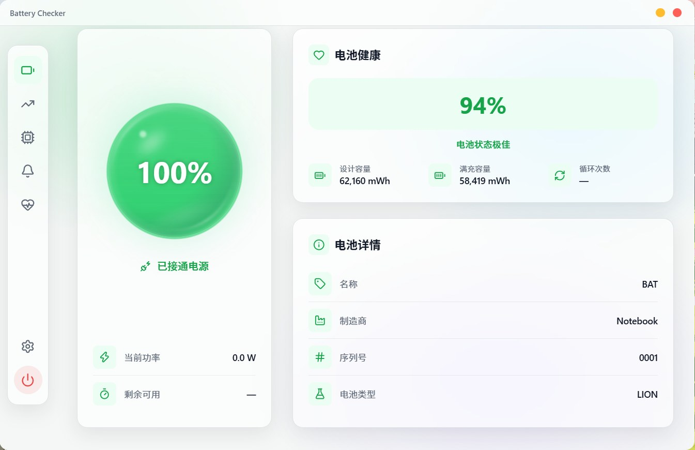
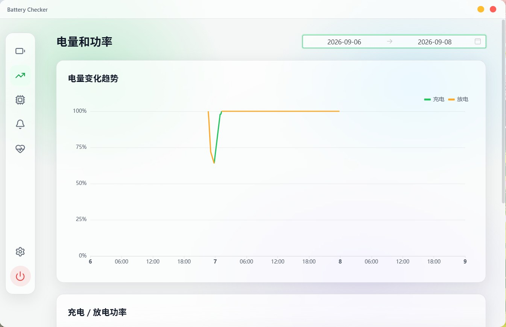
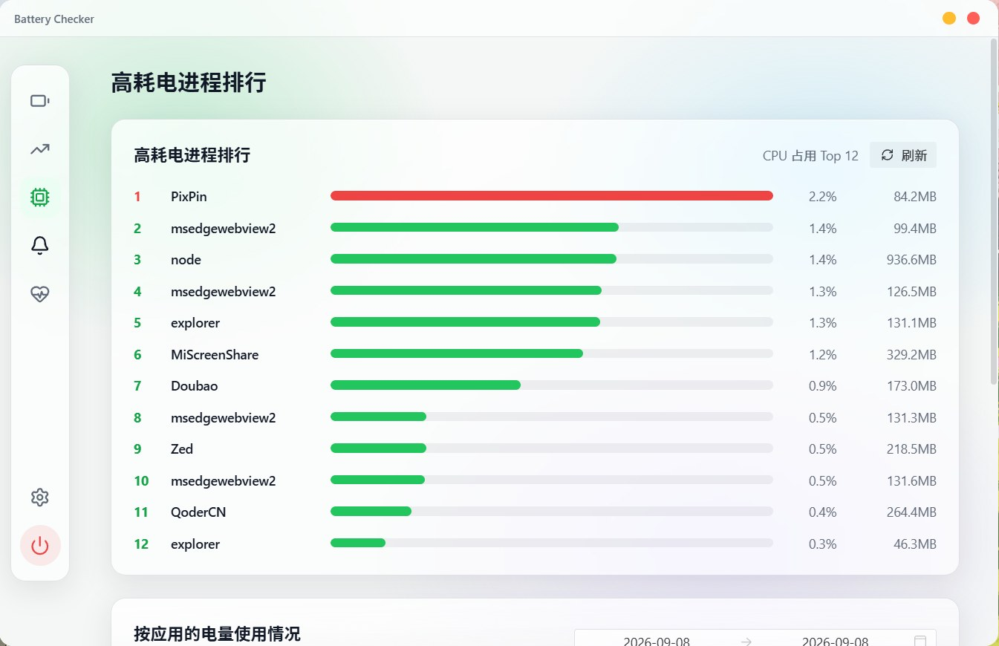
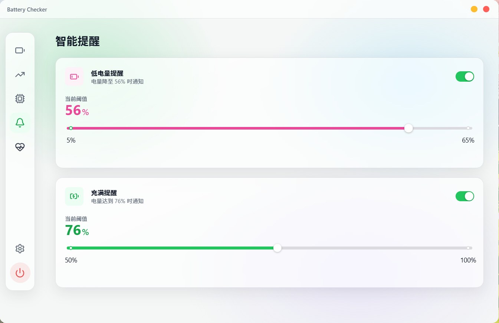
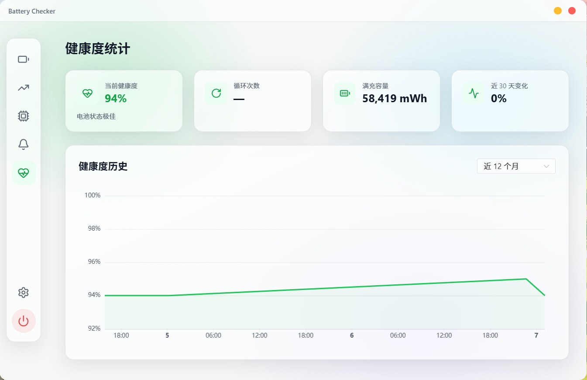
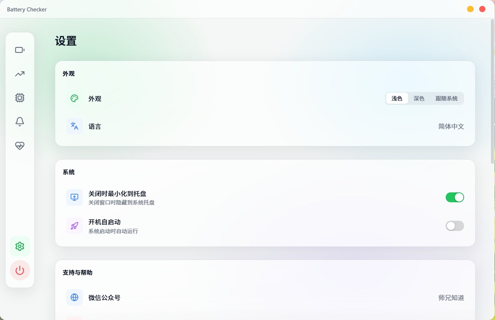

# Battery Checker —— Windows 电池监控小工具

> 给笔记本电池做长期体检：健康度、充电趋势、谁在耗电、低电量提醒，全在一个几 MB 的小窗口里。
> 无需注册、无需登录、不额外装任何运行时，下载安装即用。

面向English使用者的说明 · [English documentation](./README.md)

<!--
  配图待补：截图放入 docs/assets/screenshots/ 后，把下方「界面预览」里对应的图片行去掉注释即可。
  1. dashboard.png    首页：电量球 + 功率/时间两行 + 电池健康 + 电池详情
  2. trend.png        电量和功率页：上下两张对齐的图
  3. processes.png    高耗电进程 + 按应用的电量使用情况
  4. health.png       健康度统计 + 健康度历史折线
  5. alerts.png       智能提醒页（两个阈值滑杆）
  6. settings.png     设置页（外观 / 系统 / 软件更新）
-->

## 界面预览
| | |
|---|---|
|  |  |
|  |  |
|  |  |
<!--  -->
<!--  -->
<!--  -->
<!--  -->
<!--  -->
<!--  -->

> 界面本身长这样：左侧一列纯图标导航，共 6 页 —— 电池 / 趋势 / 进程 / 告警 / 健康 / 设置，深浅色两套主题自适应。

---

## 为什么需要它

Windows 自己只告诉你"还剩 43%"，其余一概不讲：

| 你想知道的 | 系统自带 | Battery Checker |
|---|---|---|
| 电池还能用几年、衰减了多少 | 界面里看不到（要自己跑 `powercfg /batteryreport`）| 健康度百分比 + 长期历史曲线 |
| 每天几点充电、充到多少、什么时候拔的电 | 看不到（命令报告里有很粗的一段段记录）| 电量趋势图，可回看近 1 年 |
| 现在正在耗多少瓦、还能撑多久 | 只有笼统的"剩余时间" | 实时功率 + 充满还需 / 剩余可用 |
| 哪个软件在偷电 | 任务管理器只有 CPU | 高耗电进程排行 + 按应用的耗电占比 |
| 电量低了提醒我一句 | 只有一套固定行为的低电量横幅提示 | 低电量 / 充满阈值可自定义 |

全部数据都来自系统接口直读，不做任何"猜"：电量、功率、设计容量、满充容量都取电池驱动上报的原值。

---

## 功能一览

### 电池电量（首页）

- **水波电量球**：实时电量，超过 60% 绿、21~60% 黄、20% 及以下红，充电时数字上方有闪电标记。**点一下球体就是刷新**。
- **实时功率两行**：充电功率 / 放电功率（瓦特），以及"充满还需"、"剩余可用"（按驱动上报的瞬时功率算，不是系统那个笼统估计）。
- **电池健康**：健康度 + 设计容量 / 满充容量 / 循环次数，并给出"状态极佳 / 良好 / 一般 / 需要更换"的结论。
- **电池详情**：电池名称、制造商、序列号、电池类型（如 LION）。

### 电量和功率（趋势页）

- **电量变化趋势**：充电段绿线、放电段黄线，一眼看出哪天充到几点、哪天用到断电。
- **充电 / 放电功率**：与趋势图共用同一时间范围、上下对齐，看得到充电功率什么时候掉下来（说明接近充满）。
- 时间范围自选，带「近 1 天 / 3 天 / 7 天 / 1 个月 / 1 年」快捷项，默认显示今天。

### 进程（耗电排行）

- **高耗电进程排行**：CPU 占用 Top 12 + 内存占用，已按逻辑核心数折算为**整机百分比**（不是单核口径，数值不会虚高好几倍）。
- **按应用的电量使用情况**：按你选择的时间段，统计各应用累计占了多少耗电份额。
- 两张排行都支持**双击应用名**或**右键「打开程序位置」**，直接在资源管理器里定位到那个程序。

### 智能提醒

- **低电量提醒**：电量降到阈值时弹一条系统通知，阈值可调 5~65%（默认 20%）。
- **充满提醒**：电量达到阈值时通知，可调 50~100%（默认 80%）。
- 只在"跨过阈值"的那一刻提醒一次，不会每 5 秒重复弹窗骚扰你。
- 如果 Windows 的通知总开关被关掉了，这一页顶部会直接告诉你"提醒无法显示"并给出开启路径——不会出现"设了提醒却什么都没弹"的冤枉情况。

### 健康（健康度统计）

- 当前健康度、循环次数、满充容量、近 30 天变化。
- **健康度历史曲线**：可选近 1~12 个月、近 2 / 3 / 5 年，或全部；用来判断"这电池是不是该换了"。

### 设置

- 外观：浅色 / 深色 / 跟随系统。
- 语言：简体中文 / English（界面、图表坐标轴、日期全部跟随）。
- 系统：关闭时最小化到托盘、开机自启动。
- 软件更新：手动检查更新。

### 常驻能力

- **系统托盘**：关掉窗口只是隐藏，监控不断；**左键单击**托盘图标直接唤回窗口，**右键**弹出 显示 / 退出 菜单。想彻底退出也可以用侧栏底部的电源按钮（会弹确认）。
- **自动更新**：发现新版本弹窗提示，一键下载并安装重启，支持"忽略本次更新"。

---

## 快速上手（3 分钟）

1. 下载下方的安装包，双击安装（不需要管理员权限）。
2. 首次启动即显示当前电量、功率、健康度。
3. 到「智能提醒」把低电量阈值调成你习惯的数字（经常外出的人建议 30% 左右）。
4. 想让开机后自动开始记录，到「设置」打开「开机自启动」。
5. 用上一两周后回到「趋势」和「健康」两页，就能看到完整的充电习惯与衰减走向。

> 小提示：窗口右上角的叉默认是**隐藏到托盘**，不是退出。托盘图标消失又不想重启电脑时，任务管理器里结束 `battery-checker.exe` 即可。

---

## 下载与安装

| 渠道 | 地址 |
|---|---|
| Gitee（国内推荐，下载快） | https://gitee.com/ShiXiongZhiDao/BatteryChecker/releases |
| GitHub | https://github.com/ShiXiongZhiDao/BatteryChecker/releases |

- 安装包形如 `Battery Checker_1.1.12_x64-setup.exe`（NSIS，体积约 3~4 MB），另有同名 `.msi` 供批量部署使用。
- 安装模式为"仅当前用户"，装进你当前用户的目录，**不弹 UAC、不需要管理员权限**。
- 安装包语言可选简体中文 / English。

### 系统要求

- Windows 10 或 Windows 11，64 位。
- WebView2 Runtime（Windows 11 自带；Windows 10 通常已随系统更新装好，缺失时安装程序会引导你下载）。
- 需要**内置电池**的笔记本 / 二合一设备。台式机无电池时应用能正常安装运行，但界面会显示"未检测到电池"。

### 安装时 Windows 提示"已保护你的电脑"

这是因为本安装包**未购买付费代码签名证书**，SmartScreen 因"不认识发布者"而拦截，不是病毒。
点「更多信息」→「仍要运行」即可继续。源码与安装包在同一仓库公开，欢迎自行核对。

---

## 更新、数据与卸载

### 自动更新

- 应用**每次启动会自动检查一次**更新；发现新版本弹窗提示，点「更新」即自动下载安装并重启，也可以选「稍后处理」或「忽略本次更新」（后者会记住这个版本，不再弹它）。
- 也可随时手动检查：设置 → 软件更新 → 检查更新，已是最新会提示"当前版本已经是最新版本"。

### 数据会不会因更新丢失

不会。更新只覆盖程序文件，你的历史记录与设置全部原样保留。

### 卸载

在「设置 → 应用 → 安装的应用」（Windows 10 为「应用和功能」）里找到 Battery Checker 卸载即可，卸载器**不会删除**上面的数据目录。
想彻底清掉记录（比如把电脑送人），卸载后再删掉 `%APPDATA%\com.shixiong.battery-checker` 这个文件夹。

---

## 隐私说明

- **所有电池数据、进程列表、应用排行都只写在你这台机器的本地文件里，不上传。** 本应用不采集、不传输任何电池读数。

---

## 常见问题

**Q：设了低电量提醒，但电量掉下去什么都没弹。**
先看「智能提醒」页顶部有没有"Windows 通知已关闭"的提示；有就是系统层面被关了，去 设置 → 系统 → 通知 打开「获取来自应用和其他发送者的通知」。另外提醒只在**跨过阈值的瞬间**触发一次：如果启动时电量已经低于阈值，会在首次读数时补报一次，但之后电量在阈值下方来回抖动不会重复弹。

**Q：循环次数显示 `—`，是坏了吗？**
不是。这个数值要电池固件自己上报，不少笔记本的驱动就是不报这个值，Windows 自带的 `powercfg /batteryreport` 报告里同样显示 `-`。应用不做假的推算，读不到就显示 `—`。

**Q：健康度为什么在 94% / 96% 之间来回跳？**
满充容量本身每次读数就有约 1% 的抖动（同一块电池实测 58264~59407 mWh 之间浮动），足以让取整后的健康度翻一档。为此健康度快照只在**变化超过设计容量 3% 或循环次数变了**时才追加一条，避免曲线上出现假的"衰减台阶"。

**Q：「充满还需」/「剩余可用」显示 `—`。**
这几种情况会显示 `—`：电池驱动不上报瞬时功率、只上报相对容量、或功率低于 1 W（涓流充电、已经充满）。这是诚实的"不知道"，比给你一个乱跳的数字有用。

**Q：趋势页 / 健康度页是空的。**
记录只在应用运行时产生。刚装好、或者大部分时间都退出了应用，自然就没有曲线。建议打开「开机自启动」并让它可以最小化到托盘。

**Q：「按应用的电量使用情况」准不准？**
它是**估算**：按 CPU 时间份额折算的占比，不含 GPU、屏幕、磁盘的权重（所以放着视频的浏览器会偏低），且只覆盖本应用运行期间。卡片副标题已注明这个口径。想要系统级的精确统计可以用 `powercfg /srumutil`（需管理员权限）。

**Q：高耗电进程排行里看不到某些系统进程。**
非管理员权限下，部分受保护进程读不到，会缺席排行。这是权限限制，不是 bug。

**Q：换电脑 / 重装系统，历史能带走吗？**
能。把 `%APPDATA%\com.shixiong.battery-checker\` 整个文件夹拷到新机器同一路径即可（标识一致，直接续上）。

**Q：杀毒软件报毒。**
未签名的小工具容易被个别杀软误报。

---

## 当前版本与更新日志

- 当前版本：**v1.1.16**

## ☕ 支持作者

如果这个小工具帮到了你，可以扫码请师兄喝杯水 —— 你的支持是持续改进的动力：

<table>
  <tr>
    <th align="center">支付宝</th>
    <th align="center">微信支付</th>
  </tr>
  <tr>
    <td align="center">
      
    </td>
    <td align="center">
      
    </td>
  </tr>
</table>

## 许可与声明

本工具**免费使用**。

<!-- TODO（维护者）：仓库目前没有 LICENSE 文件，下面这句等作者确认许可条款后再定稿 -->
仓库尚未附带标准许可证文件，授权条款待补充；在此之前，请将本仓库视为**保留所有权利**，不要将源码或安装包用于商业分发。
